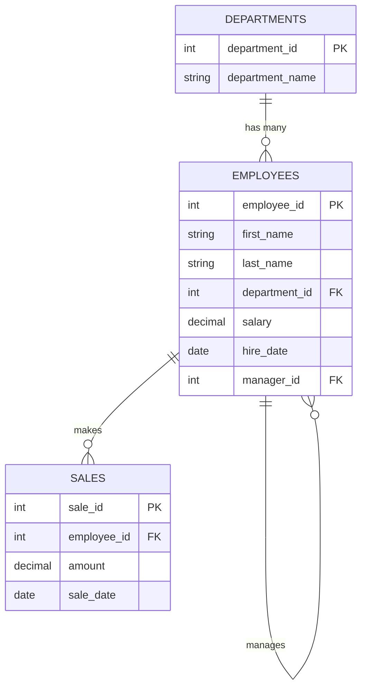

# 🚀 SQL, NoSQL & GraphQL Interview Practice Lab

A zero-setup, containerized sandbox environment powered by **Docker**, **PostgreSQL 16**, **MongoDB 7.0**, and **PostGraphile (GraphQL Engine)**, pre-populated with realistic schemas and datasets to practice SQL, NoSQL, and GraphQL interview questions from beginner to advanced levels.


---

## 🛠️ Prerequisites

Before getting started, make sure you have the following tools installed:

1. **[Docker Desktop](https://www.docker.com/products/docker-desktop/)** (version 20+ and Docker Compose v2+).
2. **Code Editor** (VS Code / Any other IDE).
3. **Database Extension** (Recommended: **`PostgreSQL`** by *Microsoft* or **`Database Client`** by *cweijan*).

---

## ⚡ Quick Start

### 1. Clone & Start Containers
Run the following command in your terminal inside the project directory:

```bash
# Option A: Start the ENTIRE sandbox environment (SQL, NoSQL, GraphQL & Web GUIs)
docker compose --profile all up -d

# Option B: Start SQL only (PostgreSQL + PGWeb Client)
docker compose --profile sql up -d

# Option C: Start GraphQL only (PostgreSQL + GraphiQL IDE)
docker compose --profile graphql up -d

# Option D: Start NoSQL only (MongoDB)
docker compose --profile nosql up -d
```

### Included Containers:
* **PostgreSQL 16** container (`sql_interview_postgres`) on port `5432`.
* **MongoDB 7.0** container (`nosql_interview_mongo`) on port `27017`.
* **PGWeb GUI** container (`sql_interview_pgweb`) on port `8081`.
* **GraphQL Engine & GraphiQL IDE** container (`sql_interview_graphql`) on port `5000`.
* Automatically executes `sql_init/01_schema_and_data.sql` to populate initial datasets.


---

## 🌐 Web GUIs & Interactive IDEs

* **PostgreSQL Web Client (pgweb):** 👉 **[http://localhost:8081](http://localhost:8081)**
* **GraphQL Interactive Playground (GraphiQL):** 👉 **[http://localhost:5000/graphiql](http://localhost:5000/graphiql)**

> 💡 **GraphQL Practice Guide:** Open [`graphql_practice.graphql`](file:///Users/usermone/local/projects/sql/sql-interview-lab/graphql_practice.graphql) to copy-paste pre-built queries for Fields, Relational Joins, Filtering, Aliases, Fragments, Variables, and Mutations!

---

## 🐘 Connection Details

#### PostgreSQL (Relational Database)
* **Host:** `localhost` (or `127.0.0.1`)
* **Port:** `5432`
* **User:** `admin`
* **Password:** `adminpassword`
* **Database:** `interview_db`

#### 🍃 MongoDB (NoSQL Database)
* **Host:** `localhost` (or `127.0.0.1`)
* **Port:** `27017`
* **User:** `admin`
* **Password:** `adminpassword`
* **Database:** `interview_nosql`

#### 🚀 GraphQL Engine (PostGraphile)
* **GraphiQL IDE:** `http://localhost:5000/graphiql`
* **GraphQL HTTP Endpoint:** `http://localhost:5000/graphql`


---

## 📊 Database Schema (ERD Diagram)

### 🐘 PostgreSQL Relational Schema (ERD)

The PostgreSQL database (`interview_db`) comes pre-seeded with 3 relational tables (`departments`, `employees`, `sales`):



### 🍃 MongoDB NoSQL Collections & Document Structure

The MongoDB database (`interview_nosql`) comes pre-seeded with 3 document collections (`employees`, `projects`, `activity_logs`) via `mongo_init/01_init_nosql.js`:

```json
// Collection: employees
{
  "employee_id": 101,
  "first_name": "Alice",
  "last_name": "Smith",
  "department": "Engineering",
  "salary": 85000,
  "skills": ["JavaScript", "Python", "MongoDB"],
  "hire_date": "2021-03-15T00:00:00Z",
  "address": { "city": "San Francisco", "state": "CA" },
  "status": "Active"
}

// Collection: projects
{
  "project_id": "PROJ-1",
  "name": "Cloud Migration",
  "lead_employee_id": 102,
  "budget": 150000,
  "tags": ["Cloud", "DevOps"],
  "status": "In Progress"
}
```

---


## 💻 Running Queries

### Option A: Via Web Browser (easiest)
Navigate to **[http://localhost:8081](http://localhost:8081)**.

### Option B: Via VS Code Extension
1. Install the **PostgreSQL** extension by *Microsoft*.
2. Add a new PostgreSQL connection using the credentials above.
3. Open any `.sql` file, select your query, and run it!

### Option C: Via Terminal CLI
```bash
# Connect to PostgreSQL CLI
docker exec -it sql_interview_postgres psql -U admin -d interview_db

# Or run a single query directly
docker exec -i sql_interview_postgres psql -U admin -d interview_db -c "SELECT * FROM employees;"
```

---

## 📚 Study Plan & Practice Challenges (Step-by-Step)

Follow this 5-day structured curriculum to master technical SQL interview questions.

---

### 📅 Day 1: Basic Filtering & Aggregations

#### Key Concepts & Execution Order:
In SQL, queries execute in this logical order:
1. `FROM` & `JOIN` -> 2. `WHERE` -> 3. `GROUP BY` -> 4. `HAVING` -> 5. `SELECT` -> 6. `ORDER BY` -> 7. `LIMIT`

> ⚠️ **Interview Trap:** `WHERE` filters rows *before* grouping, while `HAVING` filters groups *after* aggregation. You cannot use aggregate functions (`SUM`, `AVG`, `COUNT`) inside a `WHERE` clause.

#### 📝 Challenge 1.1: Department Salary Summary
> **Task:** Write a query to find the department ID, total number of employees, and average salary (rounded to 2 decimal places) for each department. Only include departments that have **more than 1 employee**, and order the results from highest to lowest average salary.

<details>
<summary>🔍 Click to view Solution 1.1</summary>

```sql
SELECT 
    department_id,
    COUNT(*) AS total_employees,
    ROUND(AVG(salary), 2) AS avg_salary
FROM employees
GROUP BY department_id
HAVING COUNT(*) > 1
ORDER BY avg_salary DESC;
```
</details>

---

### 📅 Day 2: Table Joins (`INNER`, `LEFT`, `RIGHT`, `FULL`, `SELF JOIN`)

#### Key Concepts:
* `INNER JOIN`: Returns rows where there is a match in both tables.
* `LEFT JOIN`: Returns all rows from the left table and matched rows from the right table (populates `NULL` when there is no match).
* `SELF JOIN`: Joining a table to itself to resolve hierarchical data (e.g., employee to manager).

> ⚠️ **Interview Trap (`COUNT(*)` vs `COUNT(col)`):** When doing a `LEFT JOIN` on a department with 0 employees (like `'Marketing'`), `COUNT(*)` counts the `NULL` row as `1` (incorrect), whereas `COUNT(e.employee_id)` ignores `NULL` and correctly returns `0`.

#### 📝 Challenge 2.1: Complete Department Roster (Handling 0 Employees)
> **Task:** List all department names and their total employee count. Ensure that departments with zero employees (e.g., Marketing) are included in the results with a count of `0`.

<details>
<summary>🔍 Click to view Solution 2.1</summary>

```sql
SELECT 
    d.department_name,
    COUNT(e.employee_id) AS total_employees
FROM departments d
LEFT JOIN employees e ON d.department_id = e.department_id
GROUP BY d.department_name
ORDER BY total_employees DESC;
```
</details>

#### 📝 Challenge 2.2: Employee Manager Mapping (SELF JOIN)
> **Task:** List each employee's first name alongside their direct manager's first name. Include employees who do not have a manager (their manager name should display as `No Manager`).

<details>
<summary>🔍 Click to view Solution 2.2</summary>

```sql
SELECT 
    e.first_name AS employee_name,
    COALESCE(m.first_name, 'No Manager') AS manager_name
FROM employees e
LEFT JOIN employees m ON e.manager_id = m.employee_id;
```
</details>

---

### 📅 Day 3: Window Functions (`ROW_NUMBER`, `DENSE_RANK`, `LEAD/LAG`)

#### Key Concepts:
Unlike `GROUP BY`, Window Functions perform calculations across a set of table rows related to the current row **without collapsing the individual rows**.

* `ROW_NUMBER()`: Unique sequential integer per partition (1, 2, 3, 4).
* `RANK()`: Rank with gaps for ties (1, 2, 2, 4).
* `DENSE_RANK()`: Rank without gaps for ties (1, 2, 2, 3).
* `LAG(col, offset)` / `LEAD(col, offset)`: Access data from preceding or succeeding rows.

#### 📝 Challenge 3.1: Top 2 Highest Paid Employees per Department
> **Task:** Find the top 2 highest-earning employees in **each department**. If there are salary ties, use `DENSE_RANK()` so tied employees receive the same rank.

<details>
<summary>🔍 Click to view Solution 3.1</summary>

```sql
WITH RankedSalaries AS (
    SELECT 
        e.first_name,
        e.last_name,
        d.department_name,
        e.salary,
        DENSE_RANK() OVER (PARTITION BY e.department_id ORDER BY e.salary DESC) AS rnk
    FROM employees e
    JOIN departments d ON e.department_id = d.department_id
)
SELECT department_name, first_name, last_name, salary
FROM RankedSalaries
WHERE rnk <= 2;
```
</details>

---

### 📅 Day 4: Common Table Expressions (CTEs) & Subqueries

#### Key Concepts:
CTEs (`WITH cte_name AS (...)`) make complex subqueries readable and modular.

#### 📝 Challenge 4.1: Employees Outperforming Average Company Sales
> **Task:** Using a CTE, calculate total sales per employee. Then, return the employee names and total sales for employees whose total sales exceed the company-wide average sale amount.

<details>
<summary>🔍 Click to view Solution 4.1</summary>

```sql
WITH EmployeeSales AS (
    SELECT 
        employee_id,
        SUM(amount) AS total_sales
    FROM sales
    GROUP BY employee_id
)
SELECT 
    e.first_name, 
    e.last_name, 
    es.total_sales
FROM EmployeeSales es
JOIN employees e ON es.employee_id = e.employee_id
WHERE es.total_sales > (SELECT AVG(amount) FROM sales);
```
</details>

---

### 📅 Day 5: Classic Interview Puzzles & MongoDB NoSQL

#### 📝 Puzzle 5.1: Finding the N-th Highest Salary (2nd Highest)
> **Task:** Find the 2nd highest salary in the entire company.

<details>
<summary>🔍 Click to view Solution 5.1</summary>

```sql
-- Method 1: Using DENSE_RANK()
WITH Ranked AS (
    SELECT salary, DENSE_RANK() OVER (ORDER BY salary DESC) AS rnk
    FROM employees
)
SELECT DISTINCT salary FROM Ranked WHERE rnk = 2;

-- Method 2: Simple OFFSET
SELECT DISTINCT salary 
FROM employees 
ORDER BY salary DESC 
OFFSET 1 LIMIT 1;
```
</details>

#### 🍃 MongoDB Practice (NoSQL)

> 💡 **MongoDB Practice Guide:** Open [`mongo_practice.js`](file:///Users/usermone/local/projects/sql/sql-interview-lab/mongo_practice.js) for full copy-pasteable MongoDB queries covering `$match`, `$group`, `$unwind`, `$lookup` (Joins), and indexing.

#### 1. Connect to Mongosh CLI:
```bash
docker exec -it nosql_interview_mongo mongosh -u admin -p adminpassword
```

#### 2. Switch to Database:
```javascript
use interview_nosql;
```

#### 3. Common Interview Query Patterns:

**Find Employees with Specific Skill in City:**
```javascript
db.employees.find({
  skills: "MongoDB",
  "address.city": "San Francisco"
});
```

**Aggregation Pipeline (Department Salary Summary):**
```javascript
db.employees.aggregate([
  { $match: { status: "Active" } },
  { 
    $group: { 
      _id: "$department", 
      total_employees: { $sum: 1 },
      avg_salary: { $avg: "$salary" } 
    } 
  },
  { $sort: { avg_salary: -1 } }
]);
```

**NoSQL JOIN ($lookup Projects with Employee Leads):**
```javascript
db.projects.aggregate([
  {
    $lookup: {
      from: "employees",
      localField: "lead_employee_id",
      foreignField: "employee_id",
      as: "lead_details"
    }
  },
  { $unwind: "$lead_details" }
]);
```

